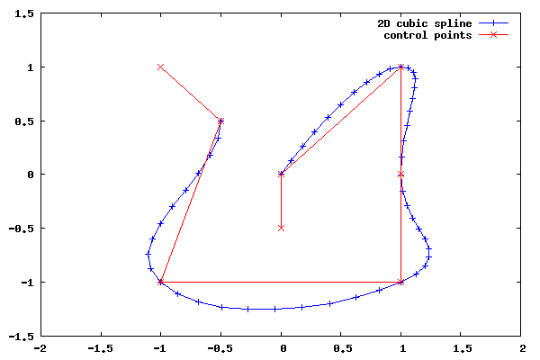

# drawspline

## Description

Implémentation C++ de [spline cubique 2D selon la méthode d'Hermite](https://en.wikipedia.org/wiki/Cubic_Hermite_spline).

## Compilation

```
mkdir build
cd build
cmake ..
make
```

## Utilisation

Le programme `drawspline.out` lit des clés-valeurs (temps, position en x,
position en y) dans l'entrée standard et écrit 100 points interpolés dans la
sortie standard.

```
$ ./drawspline.out 
0 -1 0
1 0 0
2 1 1
3 1 0
1 0 0
^D
1.01 0.0160763 0.00822718
1.02 0.0319461 0.0167236
1.03 0.047612 0.0254821
1.04 0.0630766 0.0344956
1.05 0.0783424 0.0437569
...
```

## Script d'exemple

Installer gnuplot puis :

```
cd run
./plot.sh
```




