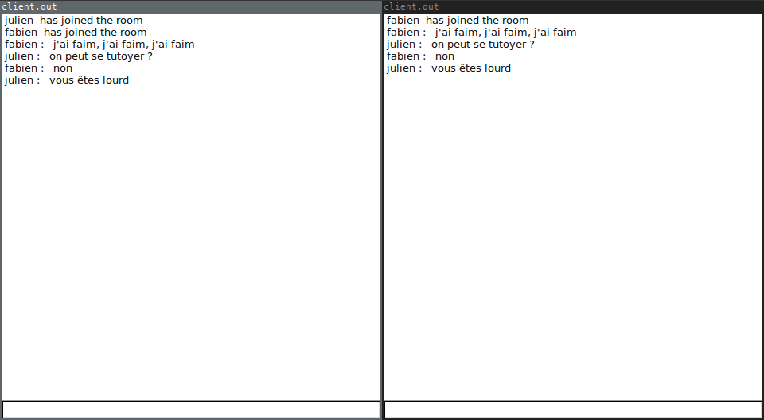

# chat

## Description

logiciel de chat basique



## Compilation

Installer g++, cmake, boost, pkgconfig, gtkmm2, sfml puis :

```
mkdir build
cd build
cmake ..
make
```

## Utilisation

- serveur :
```
./server.out 3000
```

- clients :
```
./client.out 127.0.0.1 3000 toto
```

## Bugs

- `std::bad_alloc` si on ferme tout de suite un client avec un username déjà utilisé
- broadcast d'une ligne vide, parfois

